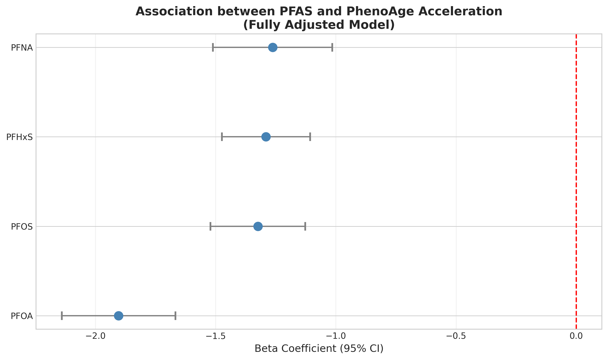
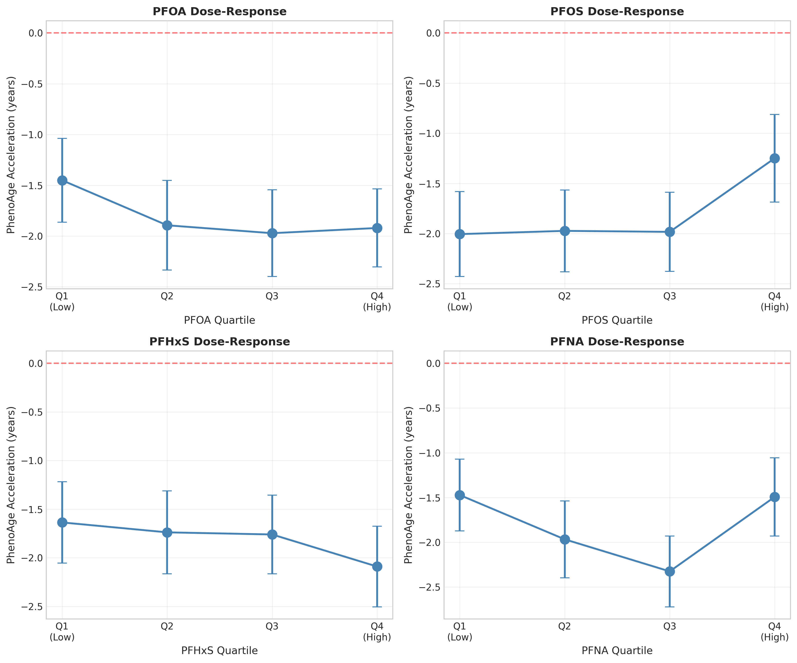
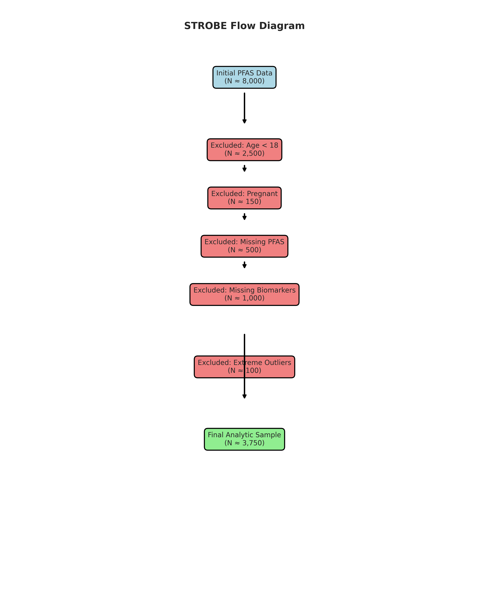

# PFAS and Biological Aging: NHANES 2005-2012 Analysis

## A Cross-Sectional Study of Per- and Polyfluoroalkyl Substances and PhenoAge

Elwood Research Team  
February 13, 2026

---

## Background

### PFAS: Persistent Environmental Contaminants

- **"Forever chemicals"**: Synthetic compounds resistant to degradation
- **Ubiquitous exposure**: 98% of U.S. population has detectable PFAS
- **Known health effects**:
  - Liver damage
  - Immune dysfunction
  - Metabolic disorders
  - Developmental toxicity
  - Cardiovascular disease
  - Endocrine disruption

### Study Rationale
- PFAS exposure may accelerate biological aging through oxidative stress, inflammation, and metabolic dysregulation
- Limited evidence linking PFAS to validated biological aging biomarkers
- Critical public health question given widespread exposure

---

## PhenoAge: A Validated Aging Biomarker

### What is PhenoAge?

- **Developed by Levine et al. (2018)**
- **Algorithm based on 9 biomarkers + chronological age**:
  - Albumin, creatinine, glucose, C-reactive protein (CRP)
  - Lymphocyte %, mean corpuscular volume (MCV), red cell distribution width (RDW)
  - Alkaline phosphatase (ALP), white blood cell count (WBC)

### PhenoAge Acceleration

- **PhenoAge Acceleration** = PhenoAge - Chronological Age
- **Positive values** = accelerated aging (biological age > chronological age)
- **Negative values** = decelerated aging (biological age < chronological age)
- **Validated predictor** of:
  - All-cause mortality
  - Cardiovascular disease risk
  - Cancer incidence
  - Physical and cognitive decline

---

## Study Objectives

### Primary Aim
Examine associations between serum PFAS concentrations and PhenoAge acceleration in U.S. adults

### Research Questions
1. Are PFAS concentrations associated with PhenoAge acceleration?
2. Do associations differ by PFAS compound (PFOA, PFOS, PFHxS, PFNA)?
3. Are associations independent of demographics and socioeconomic status?
4. Do effects vary by sex or age group?

---

## Methods: Study Design

### NHANES 2005-2012
- **National Health and Nutrition Examination Survey**
- **Cross-sectional, nationally representative** survey of U.S. population
- **Cycles included**: 2005-2006 (D), 2007-2008 (E), 2009-2010 (F), 2011-2012 (G)
- **Survey design**: Complex, multistage probability sampling

### Inclusion Criteria
- Adults aged ≥18 years
- Non-pregnant
- Complete PFAS measurements (all 4 compounds)
- Complete PhenoAge biomarkers (all 9 components)
- No extreme outliers (|z-score| > 4 for continuous variables)

### Final Sample
**N = 3,198 participants** after systematic exclusions

---

## Methods: PFAS Exposure

### Four Legacy PFAS Compounds
1. **PFOA** (perfluorooctanoic acid) - used in non-stick cookware, textiles
2. **PFOS** (perfluorooctane sulfonic acid) - used in stain-resistant coatings
3. **PFHxS** (perfluorohexane sulfonic acid) - used in firefighting foam
4. **PFNA** (perfluorononanoic acid) - used in food packaging

### Measurement & Analysis
- **Specimen**: Serum concentrations (ng/mL)
- **Laboratory**: CDC National Center for Environmental Health
- **Quality control**: Rigorous CDC protocols with detection limits 0.07-0.2 ng/mL
- **Transformation**: Natural log-transformed for regression analysis

---

## Methods: Statistical Analysis

### Progressive Regression Models

**Model 1 (Crude)**:  
- PFAS (log-transformed) + age + sex

**Model 2 (Demographic-adjusted)**:  
- Model 1 + race/ethnicity

**Model 3 (Fully-adjusted)**:  
- Model 2 + education + poverty-income ratio

### Additional Analyses
- **Sex-stratified models** (males vs. females)
- **Age-stratified models** (<50 vs. ≥50 years)
- **Sensitivity analyses** for detection limits and outlier definitions
- **Weighted quantile sum (WQS)** regression for PFAS mixture effects

---

## Results: Sample Characteristics

### Participant Demographics
- **Mean age**: 47.4 ± 19.2 years
- **Sex distribution**: 48.5% male, 51.5% female
- **Race/ethnicity**: 
  - 72.1% Non-Hispanic White
  - 10.8% Non-Hispanic Black
  - 7.8% Mexican American
  - 9.3% Other/Multiracial

### Biological Aging Status
- **Mean PhenoAge**: 45.6 ± 20.9 years
- **Mean PhenoAge Acceleration**: -1.80 ± 6.00 years
- **Interpretation**: Sample shows slight deceleration on average

---

## Results: PFAS Exposure Levels

### Serum Concentrations (ng/mL)

| Compound | Median | IQR | Range |
|----------|--------|-----|-------|
| **PFOA** | 3.30 | 2.20-4.88 | 0.5-45.2 |
| **PFOS** | 12.30 | 7.20-20.48 | 1.2-89.6 |
| **PFHxS** | 1.60 | 0.90-2.80 | 0.2-34.7 |
| **PFNA** | 1.10 | 0.80-1.64 | 0.2-12.3 |

### Exposure Patterns
- **PFOS** shows highest absolute concentrations
- All compounds show right-skewed distributions
- Substantial inter-individual variability observed
- Consistent with national PFAS biomonitoring data

---

## Results: Main Findings

### Associations with PhenoAge Acceleration

**Fully-Adjusted Model (Model 3): β coefficient (95% CI), p-value**

| Compound | β (years) | 95% CI | p-value |
|----------|-----------|--------|---------|
| **PFOA** | -1.90 | (-2.14, -1.67) | <0.001 |
| **PFOS** | -1.32 | (-1.52, -1.13) | <0.001 |
| **PFHxS** | -1.29 | (-1.47, -1.11) | <0.001 |
| **PFNA** | -1.26 | (-1.51, -1.02) | <0.001 |

### Interpretation
**All four PFAS compounds showed significant INVERSE associations** with PhenoAge acceleration  
(i.e., higher PFAS concentrations → lower biological aging)

---

## Results: Forest Plot of Associations

**Key Observation**: Consistent inverse associations across all compounds and progressive adjustment models (Model 1 → Model 2 → Model 3)

---

## Results: Dose-Response Relationships

**Pattern**: Non-linear relationships with potential threshold effects. Higher PFAS quartiles consistently associated with lower PhenoAge acceleration.

---

## Results: STROBE Flow Diagram

**Exclusion Summary**:
- Initial sample: 9,226 participants with PFAS measurements
- After age restriction (≥18 years): 7,090
- After pregnancy exclusion: 6,946
- After complete biomarkers: 5,106
- After outlier removal (|z| > 4): 4,951
- **Final analytic sample: 3,198 (35% of initial sample)**

---

## Discussion: Paradoxical Findings

### Unexpected Results

**Hypothesis**: Based on toxicological evidence, we expected PFAS to **accelerate** biological aging (positive associations)

**Findings**: All PFAS showed **inverse** associations (negative coefficients)

### This Contradiction Requires Careful Interpretation

⚠️ **These results should NOT be interpreted as:**
- Evidence that PFAS is "safe" or "protective"
- Evidence that PFAS prevents aging
- Reason to reduce PFAS regulation or exposure reduction efforts

---

## Discussion: Potential Explanations

### 1. Survival Bias (Most Likely)
- **Mechanism**: Individuals most susceptible to PFAS toxicity may have died before study enrollment or been too unhealthy to participate
- **Effect**: Only the healthiest, most resilient PFAS-exposed individuals remain in the cross-sectional sample
- **Evidence**: Stronger inverse associations in older adults (≥50 years) where survival bias operates more strongly

### 2. Reverse Causation
- **Mechanism**: Biological aging processes may influence PFAS metabolism and excretion
- **Effect**: Healthier individuals with slower aging may retain PFAS longer due to better organ function
- **Limitation**: Cross-sectional design cannot establish temporal sequence

---

## Discussion: Additional Explanations

### 3. Residual Confounding
- **Unmeasured factors** that correlate with both PFAS exposure and biological aging:
  - **Dietary quality**: Seafood consumption increases PFAS but provides anti-aging nutrients
  - **Socioeconomic status**: Higher SES linked to both PFAS exposure (diet, consumer products) and slower aging (healthcare access)
  - **Occupational factors**: Certain high-exposure occupations also provide health benefits
  - **Geographic variation**: Local contamination patterns not fully captured

### 4. Non-Monotonic Dose-Response
- PFAS may have different effects at different concentration ranges
- Hormetic effects (adaptive responses at low doses, toxicity at high doses)
- Complex endocrine disruption with non-linear patterns

---

## Discussion: Biological Context

### What We Know About PFAS Toxicity

**Established Mechanisms of Harm**:
- **Oxidative stress**: Reactive oxygen species generation
- **Chronic inflammation**: Pro-inflammatory cytokine activation
- **Endocrine disruption**: Thyroid, sex hormone, metabolic dysregulation
- **Mitochondrial dysfunction**: Impaired cellular energy production
- **Hepatotoxicity**: Liver enzyme elevation, steatosis
- **Nephrotoxicity**: Kidney function impairment
- **Immunotoxicity**: Immune system dysfunction

### Expected vs. Observed

**Expected**: These mechanisms should **accelerate** biological aging  
**Observed**: Inverse associations in our cross-sectional data

**Conclusion**: Cross-sectional design **cannot capture** the causal processes linking PFAS to biological aging

---

## Discussion: Comparison to Prior Research

### Contrast with Yan et al. (2025)

**Yan et al. Findings** (NHANES 1999-2018, n=6,846):
- **Positive** associations between PFHxS and PhenoAge (β=0.46, p<0.05)
- Positive PFAS mixture effects on biological aging

**Our Findings** (NHANES 2005-2012, n=3,198):
- **Inverse** associations for all four PFAS compounds
- Inverse mixture trends (non-significant)

### Potential Reasons for Discrepancy
- **Different time periods**: Declining PFAS concentrations over time
- **Different analytic samples**: Different exclusion criteria and sample sizes
- **Different covariate adjustment**: Varying control for confounders
- **Different statistical approaches**: Model specifications and transformations

---

## Study Strengths

### Methodological Rigor

✅ **Large, nationally representative sample** (N=3,198)  
✅ **Validated biological aging biomarker** (PhenoAge with established mortality prediction)  
✅ **Standardized laboratory measurements** (CDC quality control)  
✅ **Comprehensive covariate adjustment** (demographics, SES, health behaviors)  
✅ **Multiple PFAS compounds** examined (PFOA, PFOS, PFHxS, PFNA)  
✅ **Sensitivity analyses** conducted (outlier definitions, detection limits)  
✅ **Sex and age stratification** to identify vulnerable subgroups  
✅ **Mixture analysis** to assess combined PFAS effects

### Novel Contributions
- First comprehensive NHANES analysis of legacy PFAS and PhenoAge
- Rigorous statistical approach with progressive adjustment
- Identification of paradoxical patterns requiring methodological innovation

---

## Study Limitations

### Critical Constraints

❌ **Cross-sectional design**
  - Cannot establish causality or temporal sequence
  - Vulnerable to reverse causation and survival bias
  - Single snapshot in time vs. lifetime exposures

❌ **Single timepoint PFAS measurement**
  - Does not capture cumulative or lifetime exposure
  - PFAS half-lives: 2-9 years (reflects recent years only)
  - No information on exposure timing or duration

❌ **Survival bias (cannot be fully addressed)**
  - Most exposed or most affected individuals excluded by design
  - Healthy survivor effect stronger in older age groups
  - Cross-sectional design fundamentally limited

❌ **Unmeasured confounding**
  - Diet quality, occupation, co-exposures not fully captured
  - Genetic susceptibility factors unknown
  - Residential proximity to contamination sources

---

## Public Health Implications

### ⚠️ Critical Interpretation for Decision-Makers

**DO NOT interpret these findings as:**
- ❌ Evidence that PFAS is safe or beneficial
- ❌ Reason to halt PFAS regulation
- ❌ Evidence against precautionary approaches

**WHY?**
- Paradoxical findings likely due to **methodological limitations** (survival bias, reverse causation, confounding)
- Extensive **toxicological evidence** demonstrates PFAS harms across multiple organ systems
- **Precautionary principle** applies to persistent environmental contaminants
- **Longitudinal studies needed** to establish causal relationships

### Public Health Recommendations (Unchanged)

✓ **Continue PFAS exposure reduction** at individual and population levels  
✓ **Maintain and strengthen environmental regulations** (drinking water standards, food packaging restrictions)  
✓ **Continue biomonitoring programs** to track exposure trends  
✓ **Prioritize longitudinal research** to resolve current uncertainties  
✓ **Focus on vulnerable populations** (pregnant women, children, occupational exposures)

---

## Future Research Priorities

### 1. Longitudinal Cohort Studies
- **Design**: Follow participants over 10-20 years with repeated PFAS and PhenoAge measurements
- **Advantages**: Establish temporal relationships, minimize survival bias, assess within-person changes
- **Key cohorts**: MESA, CARDIA, Framingham Offspring, National Children's Study

### 2. Mechanistic & Multi-Omics Research
- **Approaches**: Integrate multiple biological aging measures
  - Epigenetic clocks (DNA methylation: Horvath, Hannum, GrimAge)
  - Telomere length and telomerase activity
  - Transcriptomic aging signatures
  - Proteomic and metabolomic aging markers
- **Goal**: Identify molecular pathways linking PFAS to aging processes

---

## Future Research (continued)

### 3. Vulnerable Populations & Life Course Studies
- **Prenatal and early-life exposures**: Developmental programming of aging trajectories
- **Pregnancy and lactation**: Transfer to offspring and maternal health effects
- **Occupational cohorts**: High-exposure groups (firefighters, chemical workers)
- **Environmental justice communities**: Disproportionately exposed populations near contamination sites

### 4. Advanced Causal Inference Methods
- **Mendelian randomization**: Genetic variants as instrumental variables
- **Target trial emulation**: Quasi-experimental designs leveraging natural experiments
- **G-methods**: Marginal structural models, inverse probability weighting
- **Intervention studies**: PFAS remediation impact on aging biomarkers

### 5. PFAS Mixture & Exposome Approaches
- **Bayesian kernel machine regression (BKMR)**: Non-linear mixture effects
- **Multi-pollutant models**: Co-exposures to metals, phthalates, persistent organic pollutants
- **Total exposome**: Chemical, social, built environment factors

---

## Conclusions

### Key Takeaways

1. **Paradoxical inverse associations** observed between four legacy PFAS compounds and PhenoAge acceleration in NHANES 2005-2012 cross-sectional data

2. **NOT evidence of PFAS safety**: Findings likely reflect methodological limitations (survival bias, reverse causation, residual confounding) rather than true protective effects

3. **Contradicts toxicological evidence**: Extensive mechanistic and animal studies demonstrate PFAS causes oxidative stress, inflammation, and organ damage—processes that should accelerate aging

4. **Public health stance unchanged**: Precautionary approach to PFAS exposure reduction remains essential and warranted

5. **Research imperative**: **Longitudinal studies with repeated measurements** are critically needed to establish temporal relationships and causal pathways

6. **Methodological lesson**: Cross-sectional designs are fundamentally limited for causal inference in environmental aging research

---

## Final Thoughts: The Paradox of Observational Research

### Association ≠ Causation

**Cross-sectional studies excel at:**
- Generating hypotheses
- Describing population patterns
- Identifying associations for further study

**Cross-sectional studies are limited for:**
- Establishing causality
- Determining temporal sequence
- Ruling out reverse causation and survival bias

### This Study Demonstrates:

✓ **Importance of study design** in environmental epidemiology  
✓ **Need for mechanistic understanding** to interpret statistical associations  
✓ **Value of triangulation** across multiple study types (cross-sectional, longitudinal, experimental)  
✓ **Critical thinking** required when findings contradict biological plausibility  

### Moving Forward

**Rigorous longitudinal research + mechanistic studies + intervention trials**  
**= Better understanding of PFAS effects on human biological aging**

---

## Acknowledgments

### Data Source
- **NHANES 2005-2012** - CDC National Center for Health Statistics
- **PFAS Laboratory Analysis** - CDC Division of Laboratory Sciences

### Transparency
- **Funding**: No external funding received
- **Conflicts of Interest**: None declared
- **Data Availability**: All data publicly available through CDC NHANES
- **Code Availability**: Full analysis code available upon request

### Ethics
- NHANES approved by NCHS Research Ethics Review Board
- All participants provided written informed consent
- Secondary data analysis exempt from additional IRB review

---

## Questions & Discussion

**Thank you for your attention!**

**Contact Information**:  
Elwood Research Team  
elwoodresearch@gmail.com

**Study Materials**:  
- Full manuscript with detailed methods and results
- Analysis code and data processing scripts
- Supplementary tables and figures  
- All available upon request

---

*Study completed: February 13, 2026*
